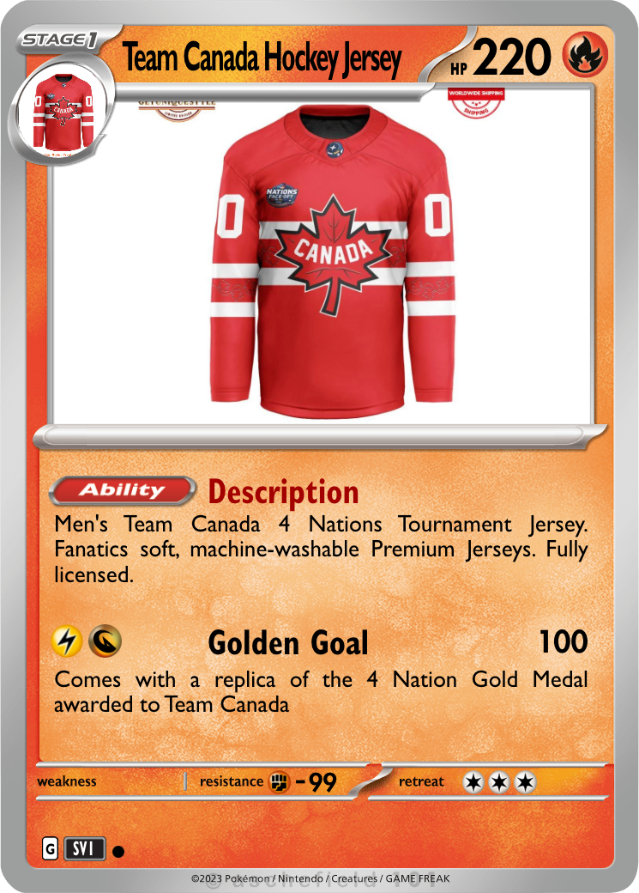

# Shopidex - A Shopify Mini App

Shopidex is a gamified shopping experience that combines the thrill of collecting trading cards with Shopify products. Think Pokémon Trading Card Game meets e-commerce!

### Demo: 
[Watch Demo Video](https://www.example.com) - See Shopidex in action!

## 🎮 Features

### Pack Opening
- Users can open different types of card packs (common, rare, legendary)
- Each pack contains Shopify product cards to collect
- Cards are beautifully designed with product images and details
- eg card:


### Shopidex Collection
- View your collected cards organized by categories:
  - Gaming 🎮
  - Music 🎵
  - Clothing 👕
- Track your collection progress
- View detailed product information
- Direct link to product pages for purchase

### Social Trading
- Trade cards with other collectors
- Share your collection
- Engage with the community
- Browse trade offers from other users

## 🛠 Technical Stack

- React Native
- TypeScript
- @shopify/shop-minis-platform-sdk
- AsyncStorage for persistent collection data
- React Navigation for seamless screen transitions


## 🎯 Future Plans

- Additional product categories
- More card variations and special editions
- Enhanced trading system with real-time interactions
- Achievement system
- Leaderboards and community features

## 💡 Business Value

- Increased user engagement through gamification
- Enhanced brand awareness and product discovery
- Social features that encourage community building
- Higher user retention through collectible mechanics
- Seamless integration with Shopify's product ecosystem


## 🚀 Getting Started

1. Install dependencies:
```bash
npm install
```

2. Run the app:
```bash
npm run start
```


## 📝 Notes

This is a prototype version with mock data for the trading system. Future iterations will include:
- Backend integration for real-time trading
- Enhanced social features
- More card categories and special events

---

Built with ❤️ using Shopify's Mini App Platform
